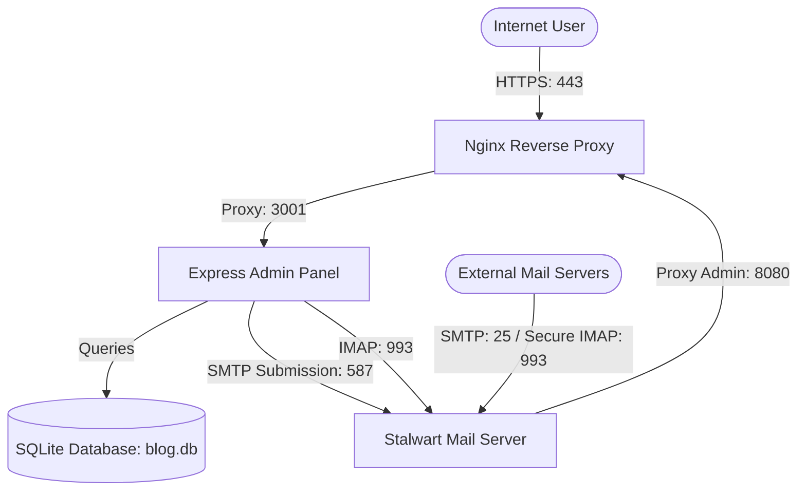

# Production Deployment Guide: Portfolio CMS & Mailbox

This document outlines the step-by-step procedure to deploy the Portfolio website, Admin Panel, and Stalwart Mail Server to a fresh Ubuntu 24.04/22.04 LTS VPS for **ghufran.net**.

---

## Server Architecture & Components



---

## Phase 1: Server Preparation

Log in to your Ubuntu VPS via SSH as root or a sudo-enabled user:

### 1. Update and Upgrade System Packages
```bash
sudo apt update && sudo apt upgrade -y
```

### 2. Install Node.js (LTS v20) & npm
```bash
curl -fsSL https://deb.nodesource.com/setup_20.x | sudo -E bash -
sudo apt install -y nodejs
```
*Verify installation:*
```bash
node -v  # Expected: v20.x.x
npm -v   # Expected: v10.x.x
```

### 3. Install Git & Build Tools (for SQLite)
```bash
sudo apt install -y git build-essential sqlite3
```

### 4. Install PM2 (Process Manager)
```bash
sudo npm install -g pm2
```

### 5. Install Nginx, UFW, & Certbot
```bash
sudo apt install -y nginx ufw certbot python3-certbot-nginx
```

---

## Phase 2: Firewall Configuration

Ensure your SSH port (default: 22) is allowed before enabling UFW to prevent lockout:

```bash
sudo ufw default deny incoming
sudo ufw default allow outgoing
sudo ufw allow 22/tcp comment 'SSH'

# Web Application Ports
sudo ufw allow 80/tcp comment 'HTTP Web'
sudo ufw allow 443/tcp comment 'HTTPS Web'

# Stalwart Mail Server Ports
sudo ufw allow 25/tcp comment 'SMTP Inbound'
sudo ufw allow 465/tcp comment 'SMTP Secure'
sudo ufw allow 587/tcp comment 'SMTP Submission'
sudo ufw allow 993/tcp comment 'IMAP Secure'

# Enable Firewall
sudo ufw enable
```

---

## Phase 3: Project Code Deployment

### 1. Clone Project Repository
```bash
cd /home/ubuntu
git clone https://github.com/your-username/portfolio.git ghufran-portfolio
cd ghufran-portfolio
```

### 2. Install Project Dependencies
Install dependencies for both the main repository and the admin-panel:
```bash
# Parent Repository
npm install

# Admin Panel
cd admin-panel
npm install
```

### 3. Create Production `.env`
Create a `.env` file inside the `admin-panel` directory:
```bash
nano .env
```
Add the following production settings:
```env
# Server Details
PORT=3001
NODE_ENV=production
SESSION_SECRET=create_a_long_random_alphanumeric_secret_here

# Stalwart Mailbox Settings
EMAIL_USER=contact@ghufran.net
EMAIL_PASS=your_mailbox_password_here

# Mail Connection Settings
IMAP_HOST=mail.ghufran.net
IMAP_PORT=993
IMAP_SECURE=true

SMTP_HOST=mail.ghufran.net
SMTP_PORT=587
SMTP_SECURE=false
```

### 4. Initialize the SQLite Database
Use the database initializer script to seed the database and create tables:
```bash
node ../scripts/init-db.js
```

### 5. Launch Application with PM2
Use the PM2 configuration file to launch the server as a background service:
```bash
pm2 start ecosystem.config.json --env production
```
Configure PM2 to automatically restore running services on server reboot:
```bash
pm2 startup
# Copy and execute the command generated by the output of the line above
pm2 save
```

---

## Phase 4: Nginx Proxy Configuration

### 1. Create Server Block for the Express App
Create a new Nginx site configuration file:
```bash
sudo nano /etc/nginx/sites-available/ghufran
```
Add the following configuration (supporting static assets caching and gzip compression):
```nginx
server {
    listen 80;
    listen [::]:80;
    server_name ghufran.net www.ghufran.net;

    # Gzip Compression Config
    gzip on;
    gzip_vary on;
    gzip_min_length 10240;
    gzip_proxied any;
    gzip_types text/plain text/css text/xml text/javascript application/javascript application/x-javascript application/xml application/json;
    gzip_disable "MSIE [1-6]\.";

    # Static Assets Cache-Control
    location ~* \.(?:css|js|jpg|jpeg|gif|png|ico|svg|woff|woff2|ttf|otf|webp)$ {
        root /home/ubuntu/ghufran-portfolio/public;
        expires 30d;
        add_header Cache-Control "public, no-transform";
        access_log off;
    }

    # Proxy to Node Express application
    location / {
        proxy_pass http://127.0.0.1:3001;
        proxy_set_header Host $host;
        proxy_set_header X-Real-IP $remote_addr;
        proxy_set_header X-Forwarded-For $proxy_add_x_forwarded_for;
        proxy_set_header X-Forwarded-Proto $scheme;
    }
}
```

### 2. Enable Site and Restart Nginx
```bash
sudo ln -s /etc/nginx/sites-available/ghufran /etc/nginx/sites-enabled/
sudo nginx -t
sudo systemctl restart nginx
```

---

## Phase 5: Let's Encrypt SSL Installation

Retrieve SSL certificates using Certbot. This automatically updates your Nginx configuration to force HTTP redirection to HTTPS:

```bash
sudo certbot --nginx -d ghufran.net -d www.ghufran.net
```
*Verification check (auto-renewal cron job is automatically enabled by certbot):*
```bash
sudo certbot renew --dry-run
```

---

## Phase 6: Stalwart Mail Server Setup

### 1. Execute Setup Script
Run the helper script `setup-mail-server.sh` to fetch Stalwart, start its service, and configure Nginx admin routing rules:
```bash
cd /home/ubuntu/ghufran-portfolio
sudo chmod +x scripts/setup-mail-server.sh
sudo ./scripts/setup-mail-server.sh
```

### 2. Secure Stalwart Admin Console
Obtain Let's Encrypt SSL certificates for the mail administration hostname:
```bash
sudo certbot --nginx -d mail-admin.ghufran.net
```

### 3. Initialize Mailbox
1. Visit `https://mail-admin.ghufran.net` in your browser.
2. Complete the admin setup wizard and set a master password.
3. Under **Domains**, add `ghufran.net`. Go to keys and copy your DKIM TXT record public key.
4. Under **Accounts**, create the mailbox account `contact@ghufran.net` and save its password to the `.env` file.

---

## Phase 7: DNS Registrar Checklist

Add these records at your DNS provider (e.g., Cloudflare, Namecheap, GoDaddy):

| Type | Hostname | Value | Purpose |
|---|---|---|---|
| **A** | `mail` | `YOUR_VPS_IP` | Mail server destination hostname |
| **A** | `mail-admin` | `YOUR_VPS_IP` | Stalwart web admin proxy |
| **MX** | `@` | `10 mail.ghufran.net.` | Routes inbound mail to Stalwart |
| **TXT** | `@` | `v=spf1 mx ip4:YOUR_VPS_IP -all` | Authorizes VPS to dispatch mail for ghufran.net |
| **TXT** | `_dmarc` | `v=DMARC1; p=reject; rua=mailto:postmaster@ghufran.net` | Set up strict alignment spoofing protection |
| **TXT** | `dkim._domainkey` | `(Value copied from Stalwart Admin Panel)` | Cryptographically signs outgoing mail headers |

---

## Phase 8: Production Verification Checklist

Execute these checks after completing deployment:
1. **Node Server Boot:** Check logs `pm2 logs` to verify `CMS Admin Panel running on: http://localhost:3001`.
2. **Nginx status:** `systemctl status nginx` is Active/Running.
3. **SSL redirection:** Accessing `http://ghufran.net` automatically redirects to `https://ghufran.net`.
4. **Local Mail diagnostics:** Execute the connection checker `node verify-email.js` to ensure the Node server successfully connects to IMAP (Port 993) and SMTP (Port 587) on the Stalwart server.
5. **E2E Email Transmission:** Send a test email from the admin panel to an external address (e.g., Gmail) and verify delivery.
